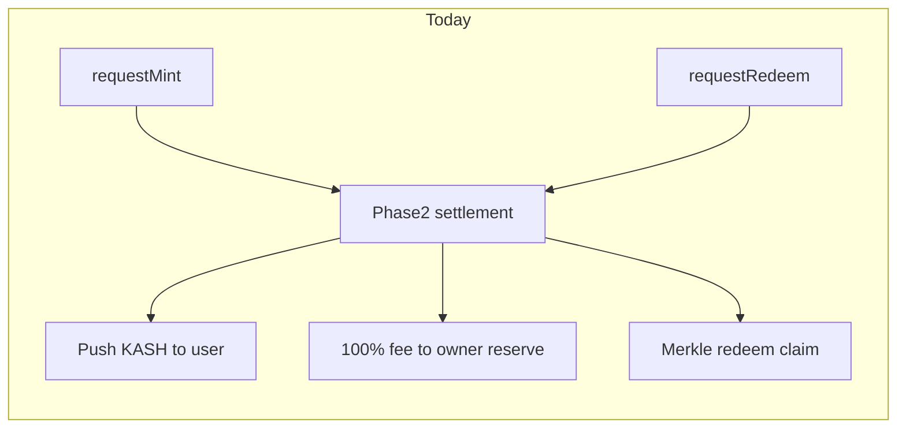
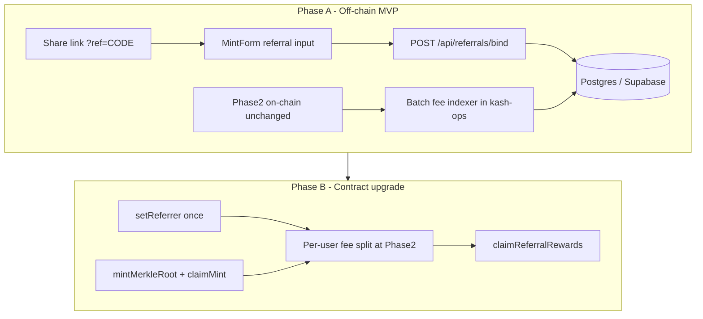
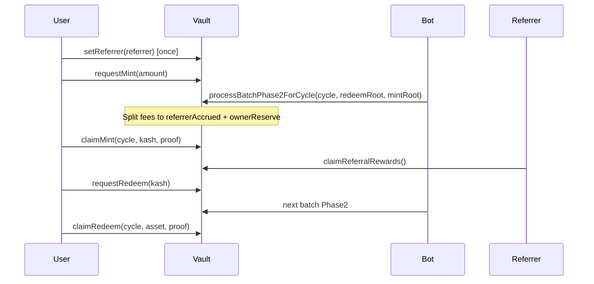

# User Referral Program Plan

## Goals

- Every connected wallet gets a **deterministic, shareable referral code** (short hex derived from address — not a custom vanity string).
- New users **enter a code on their first mint**; that binds them to a referrer **permanently** for that wallet.
- On every subsequent **mint and redeem** by that wallet, the referrer earns a **configurable share** of the protocol fee (5 bps user-facing rate today; on-chain default is 3 bps via [`feeBps`](../contracts/KashYieldETH.sol)).
- Ship **Phase A off-chain** quickly; migrate to **Phase B on-chain enforcement** in a future upgrade if needed. **Mint Merkle + O(1) Phase 1 ships first** without on-chain referral hooks.

---

## Current state (constraints)

| Area | Today |
|------|-------|
| Fees | Computed in [`_processBatchPhase2`](../contracts/KashYieldETH.sol) (~L511–565); 100% credited to `ownerEthReserve` / `protocolFeeEthReserve` |
| Mint payout | **Push** KASH transfer in Phase 2 loop |
| Redeem payout | **Pull** via `claimRedeem` + Merkle root committed at Phase 2 |
| Backend | Next.js only — [`/api/activity`](../frontend/app/api/activity/route.ts), no DB |
| Referrals | None (Aave `referralCode: 0` is unrelated) |



---

## Architecture overview



---

## Phase A — Off-chain MVP (ship first)

### A1. Referral code generation (frontend lib)

Add [`frontend/lib/referralCode.ts`](../frontend/lib/referralCode.ts):

- `referralCodeFromAddress(address)` → deterministic 8-char uppercase hex, e.g. `keccak256(lowercaseAddress).slice(2, 10)` (document algorithm; must be stable forever).
- `resolveReferralCode(code)` → checksummed address if code matches a known wallet’s derived code (validate by re-deriving).
- `referralLink(baseUrl, code)` → `https://…/app?ref=CODE`.

No DB needed for code→wallet lookup if resolution is purely deterministic.

### A2. Database (first DB in repo)

Add Postgres via **Supabase** or **Prisma + Postgres** (Vercel Postgres / Neon). Suggested tables:

```sql
-- Immutable binding: one referrer per referee wallet (global across ETH/BTC vaults)
referral_bindings (
  referee_address   text PRIMARY KEY,
  referrer_address  text NOT NULL,
  referral_code     text NOT NULL,        -- code entered at bind time
  bound_tx_hash     text NOT NULL UNIQUE,
  bound_batch_cycle bigint,
  product           text NOT NULL,      -- 'eth' | 'btc' — vault where first mint occurred
  created_at        timestamptz NOT NULL DEFAULT now()
);

-- Accrued earnings ledger (Phase A source of truth for payouts)
referral_earnings (
  id                bigserial PRIMARY KEY,
  referrer_address  text NOT NULL,
  referee_address   text NOT NULL,
  batch_cycle       bigint NOT NULL,
  product           text NOT NULL,
  flow_type         text NOT NULL,        -- 'mint' | 'redeem'
  protocol_fee_raw  numeric NOT NULL,     -- wei / satoshi units as string
  referral_share_raw numeric NOT NULL,
  tx_or_event_ref   text,                 -- batch settlement tx hash
  created_at        timestamptz NOT NULL DEFAULT now(),
  UNIQUE (referee_address, batch_cycle, product, flow_type)
);

-- Payout batches (ops-driven until Phase B)
referral_payouts (
  id, referrer_address, amount_raw, asset, status, tx_hash, created_at
);
```

Env: `DATABASE_URL` on Vercel + [`frontend/.env.example`](../frontend/.env.example).

### A3. API routes (Next.js)

| Route | Purpose |
|-------|---------|
| `GET /api/referrals/code?address=` | Return derived code + share URL |
| `GET /api/referrals/lookup?code=` | Resolve code → referrer address (deterministic verify) |
| `GET /api/referrals/binding?address=` | Return existing binding for connected wallet (if any) |
| `GET /api/referrals/earnings?address=` | Referrer dashboard: accrued + paid totals |
| `POST /api/referrals/bind` | Record binding after first mint |

**`POST /api/referrals/bind` body:** `{ refereeAddress, referralCode, mintTxHash, product }`

Validation rules:

- Referee has **no existing binding** (DB + later on-chain check in Phase B).
- Code resolves to valid referrer ≠ referee.
- Mint tx exists on Arbitrum, `from = referee`, `to = kashYield*`, selector = `requestMint`.
- Optional: tx timestamp within user window for that batch (anti-spam).

Use idempotent upsert on `bound_tx_hash` so retries from [`MintForm`](../frontend/components/MintForm.tsx) `isMintSuccess` effect are safe.

### A4. Frontend UX

**Capture referral early** — in [`Providers.tsx`](../frontend/components/Providers.tsx) or app layout:

- Read `?ref=CODE` from URL → `localStorage` key `kash-ref-pending` (same pattern as [`DisclaimerGate`](../frontend/components/DisclaimerGate.tsx)).

**Mint KASH box** — [`MintForm.tsx`](../frontend/components/MintForm.tsx):

- On load: fetch `GET /api/referrals/binding?address=`; if bound, hide input and show “Referred by …”.
- If unbound and `kash-ref-pending` set: pre-fill referral field.
- In confirm modal: optional “Referral code (optional)” — only shown when wallet has no binding.
- On `isMintSuccess`: `POST /api/referrals/bind` if code present and unbound.

**Referral panel** — new component on [`app/app/page.tsx`](../frontend/app/app/page.tsx) (below stats or in a collapsible section):

- “Your referral code: `ABC12345`” + copy link button.
- Accrued earnings summary (from earnings API).
- Note: payouts are periodic until on-chain claims go live.

**RedeemForm**: no referral input (binding is mint-only per spec).

### A5. Fee accrual indexer (kash-ops, not Kash repo)

Because Phase A does **not** change contracts, referrers are **not paid automatically on-chain**. Add a job in **kash-ops** (private repo) that runs after each batch settlement:

1. Read `BatchProcessed` + per-user fee math (mirror [`_processBatchPhase2`](../contracts/KashYieldETH.sol) and [`test/helpers/redeemMerkle.js`](../test/helpers/redeemMerkle.js)).
2. For each minter/redeemer in the batch, look up `referral_bindings.referee_address`.
3. Compute `referral_share = protocol_fee * REFERRAL_SHARE_BPS / 10000` (config constant, e.g. 50% of protocol fee — **needs product decision**).
4. Insert rows into `referral_earnings`.
5. Ops runs periodic payout script from treasury → referrers, recording `referral_payouts`.

Document in new [`docs/referrals.md`](referrals.md): economics, share %, payout cadence, grandfathering (wallets that minted before launch have no referrer).

---

## Phase B — On-chain fee split + mint Merkle (bundled upgrade)

Bundle referral enforcement with the **mint pull-claim** migration already anticipated in [`MintForm.tsx`](../frontend/components/MintForm.tsx) (TODO comment). Redeem already uses Merkle; mint should follow the same pattern.

### B1. Contract changes ([`KashYieldETH.sol`](../contracts/KashYieldETH.sol) / [`KashYieldBtc.sol`](../contracts/KashYieldBtc.sol))

**Referral storage (immutable bind):**

```solidity
mapping(address => address) public referrerOf;  // referee => referrer, address(0) = none

function setReferrer(address referrer) external {
    if (referrerOf[msg.sender] != address(0)) revert ReferrerAlreadySet();
    if (referrer == address(0) || referrer == msg.sender) revert InvalidReferrer();
    referrerOf[msg.sender] = referrer;
    emit ReferrerSet(msg.sender, referrer);
}
```

- Call **`setReferrer` before first `requestMint`** (frontend submits as two txs or multicall in one user action).
- Phase B makes DB binding a **mirror** of on-chain `referrerOf`; indexer reads chain as source of truth.

**Fee split in `_processBatchPhase2`:**

- Replace aggregate `ownerEthReserve += totalProtocolFeeEth` with per-user loop:
  - For each minter fee and redeemer fee, if `referrerOf[user] != 0`: accrue `referralAccrued[referrer][asset] += share`.
  - Remainder to `ownerEthReserve` / `protocolFeeEthReserve`.
- New owner config: `referralShareBps` (share **of the protocol fee**, not of principal).

**Referrer claims:**

```solidity
function claimReferralRewards() external nonReentrant;
```

Pull ETH/wBTC accrued — avoids push-loop gas at settlement (same rationale as redeem Merkle).

**Mint Merkle pull-claim (parallel work):**

- At Phase 2: build `mintMerkleRoot` over leaves `keccak256(abi.encode(batchCycle, user, kashAmount))` (mirror redeem leaf format in [`MerkleVerify.sol`](../contracts/libraries/MerkleVerify.sol)).
- Replace push `kashToken.transfer(user, userShare)` loop with root commit + `claimMint(batchCycle, amount, proof[])`.
- Reuse existing off-chain tree builder pattern from [`frontend/lib/redeemClaimAmount.ts`](../frontend/lib/redeemClaimAmount.ts) → new `mintClaimAmount.ts`.
- Bot (kash-ops) publishes mint proof manifests alongside redeem proofs.



### B2. Frontend updates for Phase B

- **MintForm**: replace push-settled notice with `claimMint` UI (same structure as [`RedeemForm`](../frontend/components/RedeemForm.tsx) claim box); referral bind becomes `setReferrer` tx before mint.
- **New ReferralRewards panel**: read `referralAccrued` + `claimReferralRewards` button.
- **Mint/redeem proof loaders**: extend [`redeemProofs.ts`](../frontend/lib/redeemProofs.ts) pattern for mint proofs.
- **ABI + addresses**: update [`kashYieldABI.ts`](../frontend/lib/contracts/kashYieldABI.ts) after deploy.

### B3. DB role after Phase B

- `referral_bindings`: populated from `ReferrerSet` events (indexer), not just POST bind.
- `referral_earnings`: optional cache for dashboard; chain is authoritative.
- Deprecate ops payout script once `claimReferralRewards` is live.

### B4. Tests and docs

- Unit tests: fee split math, referrer immutability, self-referral revert, claimReferralRewards.
- Fork tests: full batch with referrer on mint + redeem flows.
- Mint Merkle tests mirroring [`test/redeem-merkle.unit.test.js`](../test/redeem-merkle.unit.test.js).
- Update [`docs/fees.md`](fees.md), [`docs/depositing.md`](depositing.md), [`docs/roadmap.md`](roadmap.md).

---

## Tying referrals to mint Merkle — why bundle?

| Concern | Benefit of bundling |
|---------|---------------------|
| Contract redeploy cost | One upgrade, one audit surface, one user migration |
| Fee loop refactor | Phase 2 already iterates all minters; adding per-user fee split + Merkle mint allocation is the same pass |
| UX consistency | Mint and redeem both become “settled → claim”; referral success copy in MintForm TODO already anticipates this |
| Referrer payouts | Pull-claim for referrers aligns with pull-claim for users; avoids extra push gas in large batches |

**Recommended sequencing:**

1. Phase A live (frontend + DB + kash-ops indexer + manual payouts).
2. Design + implement Phase B contracts (mint Merkle + referrer + fee split) on testnet.
3. Migrate frontend to claim flows; backfill `referrerOf` from DB bindings via one-time `setReferrer` window **or** owner migration script (only if legally/technically acceptable — prefer users re-confirm on-chain).
4. Deploy new vaults or upgrade path per your ops model; update env addresses.

---

## Open product decisions (document before build)

- **`REFERRAL_SHARE_BPS`**: share of protocol fee to referrer (e.g. 5000 = 50% of fee → referrer gets 2.5 bps of principal at 5 bps fee). Not yet specified.
- **Grandfathering**: wallets that minted before launch cannot bind retroactively (recommended).
- **Cross-product binding**: one referrer per wallet globally across KASH-ETH and KASH-BTC (recommended).
- **Payout cadence (Phase A)**: weekly/monthly manual treasury transfers.

---

## File touch list (Phase A in Kash repo)

| File | Change |
|------|--------|
| `frontend/lib/referralCode.ts` | New — deterministic code + resolve |
| `frontend/app/api/referrals/*/route.ts` | New — CRUD/read APIs |
| `frontend/lib/db.ts` or `prisma/schema.prisma` | New — DB client |
| `frontend/components/MintForm.tsx` | Referral input + bind on success |
| `frontend/components/ReferralPanel.tsx` | New — code display + earnings |
| `frontend/app/app/page.tsx` | Mount ReferralPanel |
| `frontend/components/Providers.tsx` | `?ref=` capture |
| `docs/referrals.md` | New — program rules |
| kash-ops (external) | Batch indexer + payout runbook |

Phase B additionally touches contracts, bot Merkle builders, proof JSON layout, and both forms’ claim UX.

---

## Implementation checklist

- [ ] Add `frontend/lib/referralCode.ts` with deterministic 8-char code generation and resolution
- [ ] Add Postgres (Supabase/Prisma): `referral_bindings`, `referral_earnings`, `referral_payouts` tables + `DATABASE_URL`
- [ ] Implement `/api/referrals/*` routes (code, lookup, binding, bind, earnings)
- [ ] MintForm: URL/localStorage capture, optional referral field on first mint, POST bind on `isMintSuccess`
- [ ] ReferralPanel on app page: show code, share link, accrued earnings
- [ ] kash-ops: post-batch indexer to compute `referral_earnings` from on-chain batch data + manual payout runbook
- [ ] Write `docs/referrals.md` (economics, grandfathering, Phase A vs B)
- [ ] Phase B: bundle `setReferrer`, fee split, `claimReferralRewards`, mint Merkle + `claimMint` in vault upgrade
- [ ] Phase B: MintForm `claimMint` UI + mint proof loader mirroring RedeemForm
